# NovaSell — Autonomous AI Marketplace Sales Agent

## Try it now on https://hub.rilo.dev/
## See already running chat with Nova sell https://hub.rilo.dev/ui?agent_name=novasell&task_id=9bf89f61-af93-4c98-9fbe-30e83bcb4041

> **Fully autonomous selling agent** powered by **AWS Amazon Nova AI** that operates on **Shozon UAE**, **Dubizzle**, and **Facebook Marketplace** — handling every step from photo to sold.

NovaSell automates the complete lifecycle of selling items on online marketplaces: analyzing product photos, generating listings, posting ads (with CAPTCHA HITL), responding to buyers, negotiating prices in real time, handling phone calls via voice AI, and scheduling pickups — all orchestrated by Temporal state machines.

---

## Table of Contents

1. [System Architecture](#system-architecture)
2. [AI Model Stack](#ai-model-stack)
3. [State Machine Flow](#state-machine-flow)
4. [Workflow Deep-Dives](#workflow-deep-dives)
5. [Nova Sonic Voice Calls](#nova-sonic-voice-calls)
6. [Browser Automation & HITL](#browser-automation--hitl)
7. [Anti-Ban Strategy](#anti-ban-strategy)
8. [Data Models](#data-models)
9. [Services](#services)
10. [Activities Reference](#activities-reference)
11. [Configuration Reference](#configuration-reference)
12. [Project Structure](#project-structure)
13. [Deployment](#deployment)
14. [Getting Started](#getting-started)

---

## System Architecture

### High-Level System

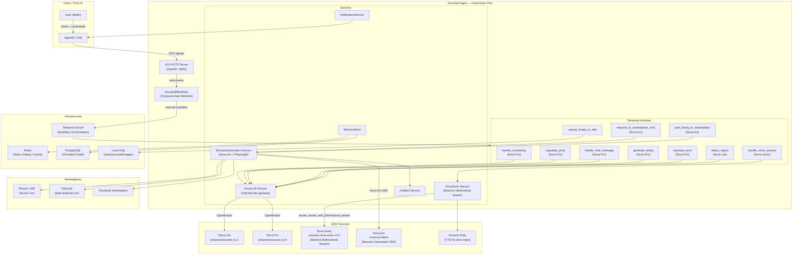

---

### Temporal Worker Architecture

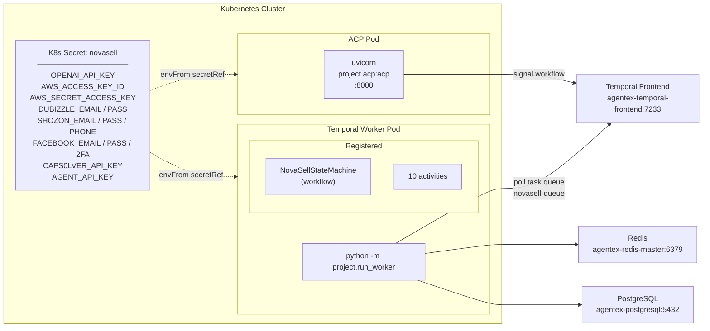

---

## AI Model Stack

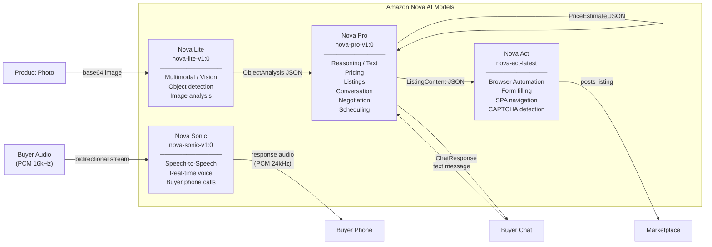

| Model | ID | Role | Key Outputs |
|-------|----|------|-------------|
| **Nova Lite** | `amazon/nova-lite-v1:0` | Vision / Multimodal | `ObjectAnalysis` — brand, model, condition score, defects |
| **Nova Pro** | `amazon/nova-pro-v1:0` | Reasoning / Text | Pricing, listings, chat replies, negotiation decisions, scheduling |
| **Nova Sonic** | `amazon.nova-sonic-v1:0` | Speech-to-Speech | Real-time voice call handling via Bedrock bidirectional stream |
| **Nova Act** | `nova-act-latest` | Browser Automation | Navigate SPAs, fill forms, upload images, handle CAPTCHA HITL |

---

## State Machine Flow

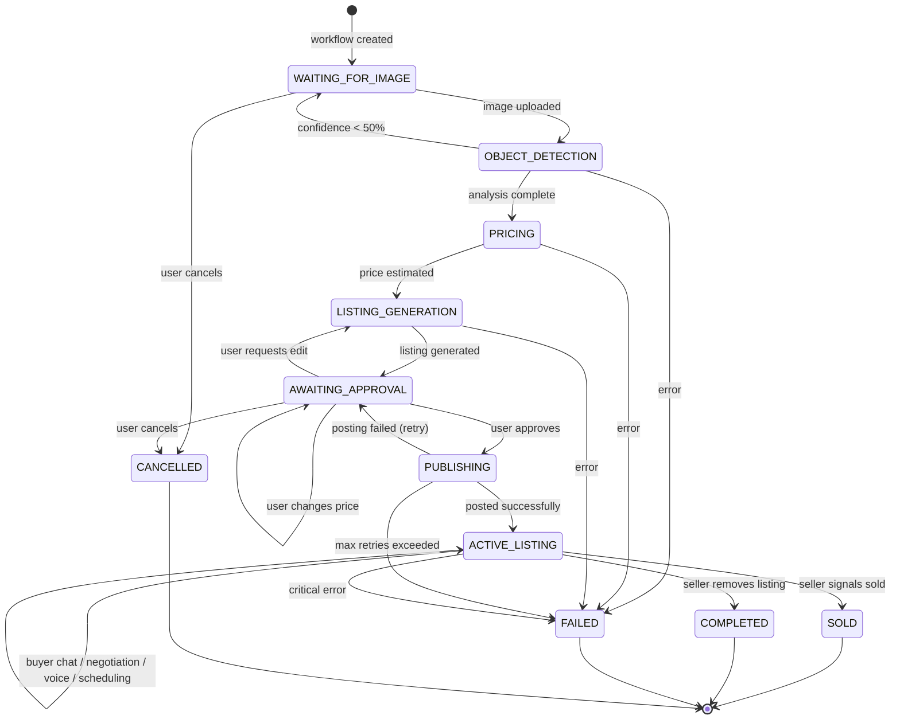

---

### State Transition Detail

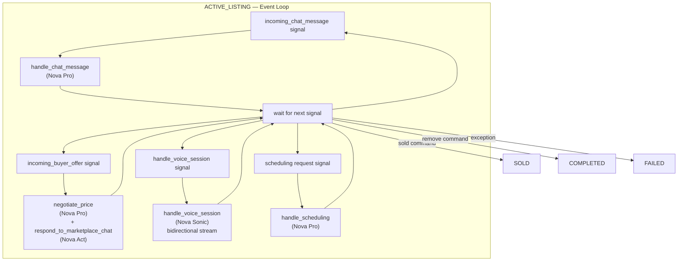

---

## Workflow Deep-Dives

### Full Listing Creation Pipeline

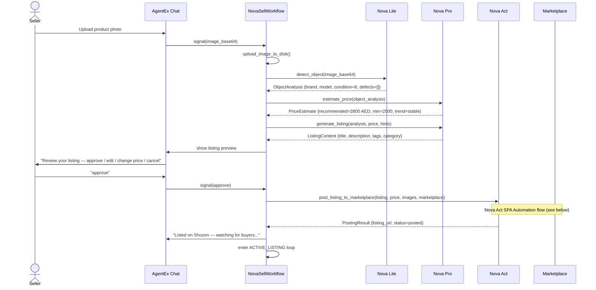

---

### Shozon Marketplace Automation (Nova Act)

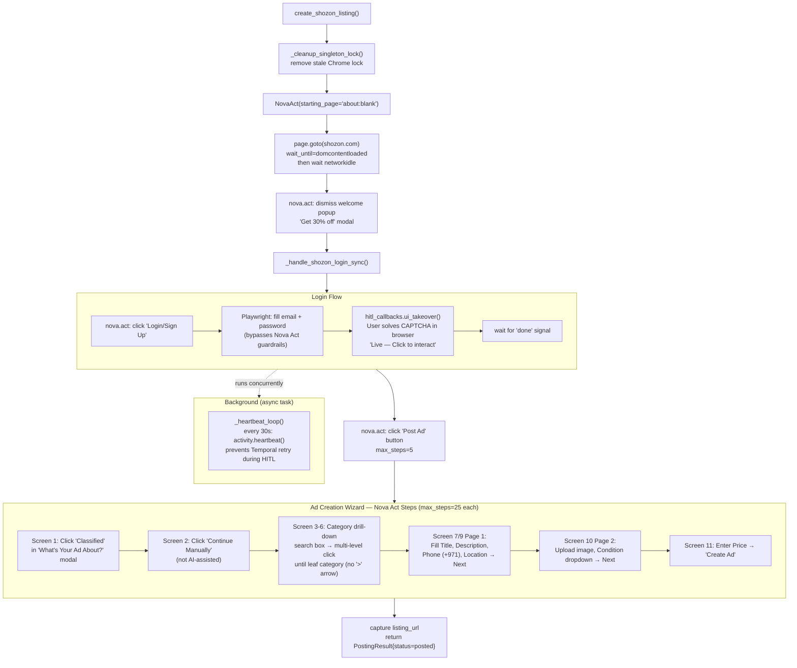

---

### Buyer Conversation & Negotiation

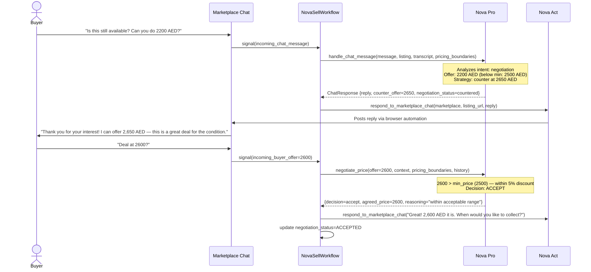

---

## Nova Sonic Voice Calls

### Real-Time Voice Architecture

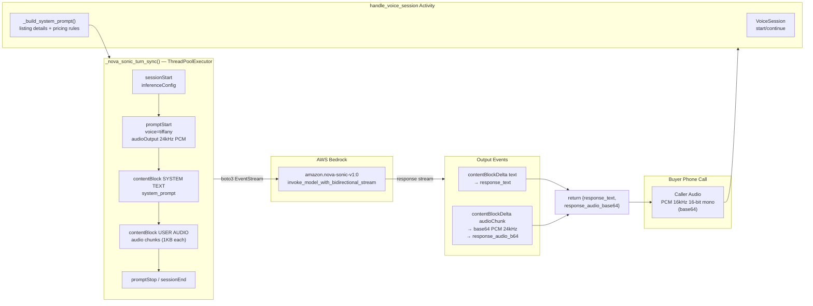

---

### Voice Session Lifecycle

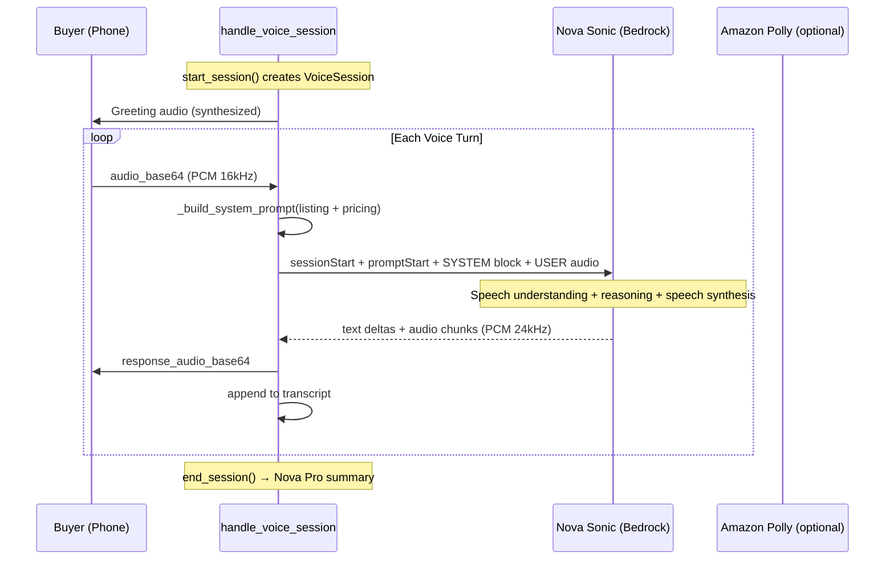

---

## Browser Automation & HITL

### HITL (Human-in-the-Loop) Flow

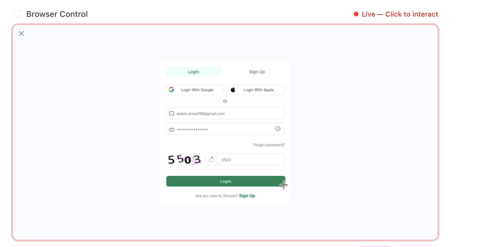

> **What you're seeing:** The AI has already filled the email and password automatically. The workflow pauses and hands the browser to the seller — who reads the CAPTCHA image (`5503`), types it in, and clicks **Login**. The red `Live — Click to interact` indicator confirms the browser is live. Once done, the Temporal workflow resumes and continues posting the ad.

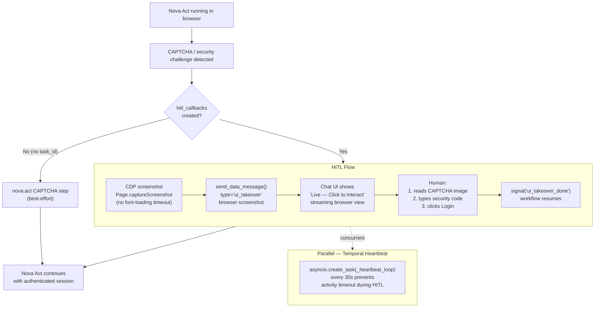
### When the agent encounters a CAPTCHA or requires human intervention, NovaSell pauses the Temporal workflow and streams a live browser view directly into the chat UI using Chrome DevTools Protocol (CDP) screenshots. The seller sees a "Live — Click to interact" prompt, takes over the browser for just that moment — solving the CAPTCHA or completing a sensitive action — then hands control back. The Temporal workflow resumes exactly where it left off, with the authenticated session intact. No automation is lost, no state is dropped.
---

### Activity Timeout Configuration

```mermaid
gantt
    title Temporal Activity Timeouts (publishing)
    dateFormat  s
    axisFormat  %Mm %Ss

    section publish activity
    start_to_close_timeout (60 min)   :active, 0, 3600
    heartbeat_timeout (2 min)         :crit, 0, 120

    section typical HITL scenario
    Navigation + Login                :done, 0, 30
    CAPTCHA HITL (user solves)        :active, 30, 300
    Post Ad + Wizard                  :done, 300, 600
```

| Timeout | Value | Why |
|---------|-------|-----|
| `start_to_close_timeout` | **60 min** | Login HITL + full wizard can take 15-45 min |
| `heartbeat_timeout` | **2 min** | Activity must heartbeat every 2 min; loop fires every 30s (4× margin) |
| `maximum_attempts` | **1** | HITL cannot be automatically retried |

---

## Anti-Ban Strategy

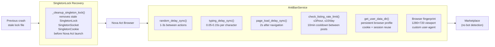

---

## Data Models

### Listing Domain Models

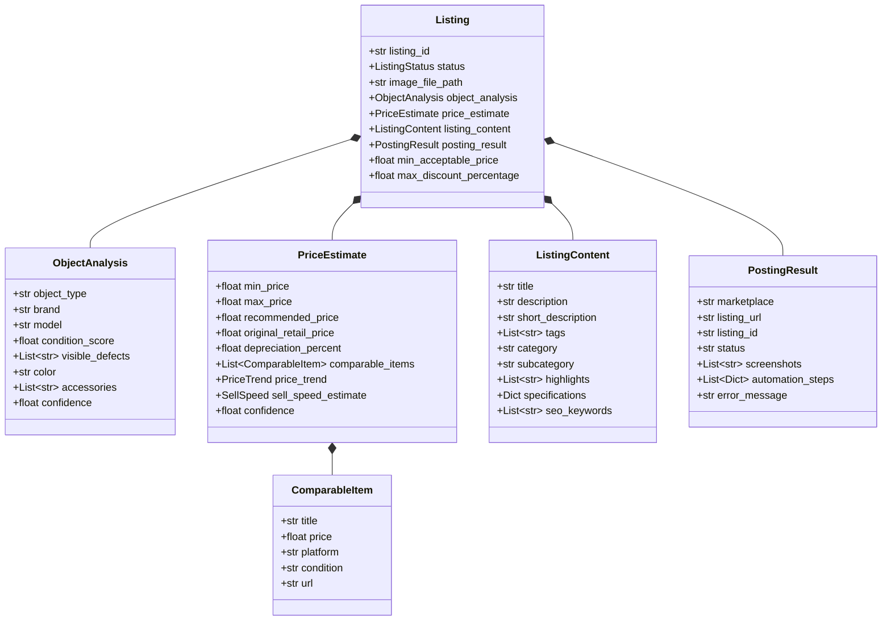

---

### Conversation Domain Models

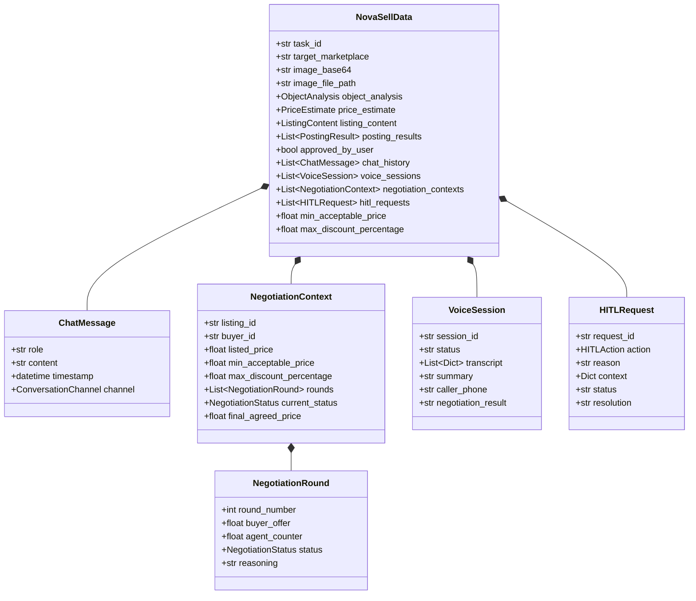

---

## Services

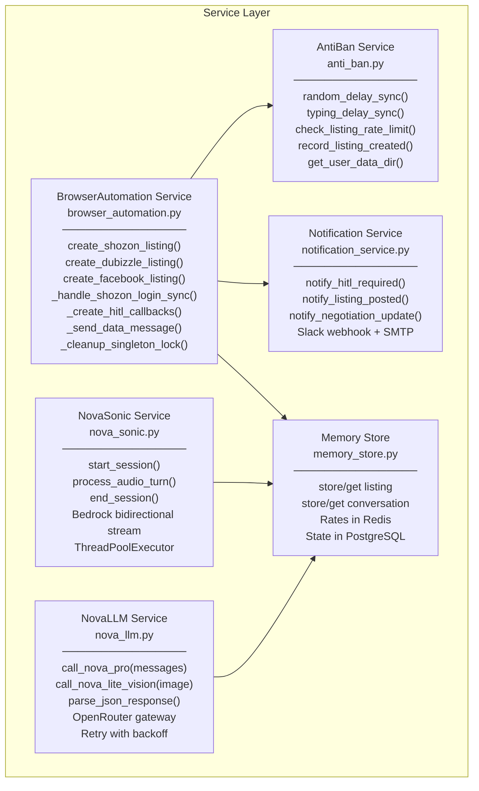

---

## Activities Reference

| Activity | Model | Timeout | Description |
|----------|-------|---------|-------------|
| `detect_object` | Nova Lite | 5 min | Multimodal image analysis → `ObjectAnalysis` |
| `estimate_price` | Nova Pro | 5 min | Dubai market valuation → `PriceEstimate` |
| `generate_listing` | Nova Pro | 5 min | SEO-optimized listing copy → `ListingContent` |
| `handle_chat_message` | Nova Pro | 3 min | Buyer Q&A, intent classification → `ChatResponse` |
| `negotiate_price` | Nova Pro | 3 min | Strategic price counter → accept/decline/counter |
| `handle_voice_session` | Nova Sonic | 10 min | Real-time voice call → `{response_text, audio_b64}` |
| `handle_scheduling` | Nova Pro | 3 min | Parse availability, confirm pickup time |
| `post_listing_to_marketplace` | Nova Act | **60 min** | Browser automation + HITL → `PostingResult` |
| `respond_to_marketplace_chat` | Nova Act | 5 min | Post reply via browser on marketplace |
| `upload_image_to_disk` | — | 1 min | Save base64 image to `/data/novasell/images/YYYY/MM/DD/` |

---

## Configuration Reference

### Environment Variables

| Variable | Default | Required | Description |
|----------|---------|----------|-------------|
| `OPENAI_API_KEY` | — | **Yes** | OpenRouter / LiteLLM gateway key |
| `OPENAI_BASE_URL` | `https://openrouter.ai/api/v1` | Yes | LLM gateway endpoint |
| `AWS_REGION` | `us-east-1` | **Yes** | AWS region (Nova Sonic requires us-east-1) |
| `AWS_ACCESS_KEY_ID` | — | **Yes** | AWS access key |
| `AWS_SECRET_ACCESS_KEY` | — | **Yes** | AWS secret key |
| `TEMPORAL_ADDRESS` | `localhost:7233` | **Yes** | Temporal frontend address |
| `DUBIZZLE_EMAIL` | — | For Dubizzle | Dubizzle account email |
| `DUBIZZLE_PASS` | — | For Dubizzle | Dubizzle account password |
| `SHOZON_EMAIL` | — | For Shozon | Shozon account email |
| `SHOZON_PASS` | — | For Shozon | Shozon account password |
| `SHOZON_PHONE` | — | For Shozon | Phone number for Shozon ads (+971…) |
| `FACEBOOK_EMAIL` | — | For FB | Facebook account email |
| `FACEBOOK_PASS` | — | For FB | Facebook account password |
| `FACEBOOK_2FA_SECRET` | — | For FB | 2FA TOTP secret |
| `CAPSOLVER_API_KEY` | — | For FB | CapSolver API key for FB CAPTCHA |
| `NOVA_ACT_USER_DATA_DIR` | `/data/novasell/nova-act-profile` | No | Persistent browser profile |
| `IMAGE_STORAGE_DIR` | `/data/novasell/images` | No | Local image storage path |
| `REDIS_URL` | `redis://localhost:6379/0` | No | Redis for rate limiting |
| `DATABASE_URL` | `postgresql+asyncpg://…` | No | PostgreSQL for persistent state |
| `SLACK_WEBHOOK_URL` | — | No | Slack HITL notification webhook |
| `ALLOWED_EMAILS` | — | No | Comma-separated authorized seller emails |
| `MIN_ACTION_DELAY` | `1.0` | No | Min browser action delay (seconds) |
| `MAX_ACTION_DELAY` | `3.0` | No | Max browser action delay (seconds) |
| `MAX_LISTINGS_PER_HOUR` | `3` | No | Rate limit: listings per hour |
| `MAX_LISTINGS_PER_DAY` | `10` | No | Rate limit: listings per day |
| `NOVA_ACT_MODEL_ID` | `nova-act-latest` | No | Nova Act model version |
| `NOVA_SONIC_MODEL` | `amazon/nova-sonic-v1:0` | No | Nova Sonic model ID |

---

## Project Structure

```
agents/novasell/
├── Dockerfile
├── pyproject.toml
├── nova_sonic_sim.py              # Standalone Nova Sonic simulation script
├── .env.example
│
├── chart/novasell/                # Helm chart
│   ├── Chart.yaml
│   └── values.yaml               # K8s deployment config + secrets
│
└── project/
    ├── __init__.py
    ├── acp.py                     # ACP server (FastAPI entry point :8000)
    ├── config.py                  # Centralized config (pydantic-settings)
    ├── constants.py               # System prompts for all Nova models
    ├── activities.py              # 10 Temporal activities (agent entry points)
    ├── workflow.py                # Main NovaSellWorkflow (signal handler + state machine runner)
    ├── run_worker.py              # Temporal worker entry point
    │
    ├── models/
    │   ├── listing.py             # ObjectAnalysis, PriceEstimate, ListingContent, PostingResult, Listing
    │   └── conversation.py        # ChatMessage, NegotiationContext, VoiceSession, HITLRequest, BuyerProfile
    │
    ├── services/
    │   ├── nova_llm.py            # Nova Pro/Lite via OpenRouter (async + multimodal)
    │   ├── nova_sonic.py          # Nova Sonic bidirectional streaming voice service
    │   ├── browser_automation.py  # Nova Act automation for Shozon / Dubizzle / Facebook
    │   ├── anti_ban.py            # Delays, rate limiting, browser fingerprinting
    │   ├── memory_store.py        # Redis + PostgreSQL state management
    │   └── notification_service.py # Slack / email HITL alerts
    │
    ├── state_machines/
    │   └── novasell_agent.py      # NovaSellState enum, NovaSellData, NovaSellStateMachine
    │
    └── workflows/
        ├── terminal_states.py     # SoldWorkflow, CompletedWorkflow, FailedWorkflow, CancelledWorkflow
        └── sell/
            ├── waiting_for_image.py   # State: wait for photo upload
            ├── object_detection.py    # State: Nova Lite image analysis
            ├── pricing.py             # State: Nova Pro market pricing
            ├── listing_generation.py  # State: Nova Pro listing copywriting
            ├── awaiting_approval.py   # State: human review & approval gate
            ├── publishing.py          # State: Nova Act marketplace posting
            └── active_listing.py      # State: live listing management loop
```

---

## Deployment

### Helm Chart

```yaml
# agents/novasell/chart/novasell/values.yaml (key values)

service:
  replicas: 1
  image: eslamanwar/rilo:agents-novasell-v0.1
  containerPort: 8000
  command: ["uvicorn", "project.acp:acp", "--host", "0.0.0.0", "--port", "8000"]
  resources:
    requests: { cpu: 250m, memory: 250Mi }
    limits:   { cpu: 1000m, memory: 2Gi }

temporal-worker:
  enabled: true
  command: python
  args: ["-m", "project.run_worker"]
  # polls task queue: novasell-queue
```

Secrets are read from a K8s secret named **`novasell`**:

```bash
kubectl create secret generic novasell \
  --from-literal=OPENAI_API_KEY=... \
  --from-literal=AWS_ACCESS_KEY_ID=... \
  --from-literal=AWS_SECRET_ACCESS_KEY=... \
  --from-literal=DUBIZZLE_EMAIL=... --from-literal=DUBIZZLE_PASS=... \
  --from-literal=SHOZON_EMAIL=...   --from-literal=SHOZON_PASS=... \
  --from-literal=SHOZON_PHONE=...   \
  --from-literal=FACEBOOK_EMAIL=... --from-literal=FACEBOOK_PASS=... \
  --from-literal=AGENT_API_KEY=...
```

---

## Getting Started

### Local Development

```bash
# 1. Install dependencies
cd agents/novasell
uv sync

# 2. Configure environment
cp .env.example .env
# Edit .env with your credentials

# 3. Start Temporal (Docker)
docker run --rm -p 7233:7233 temporalio/auto-setup:latest

# 4. Start the ACP server
uvicorn project.acp:acp --host 0.0.0.0 --port 8000 --reload

# 5. Start the Temporal worker (separate terminal)
python -m project.run_worker
```

### Test Nova Sonic Locally

```bash
# Run the standalone simulation (uses Amazon Polly for TTS input)
python nova_sonic_sim.py

# Play the response audio
ffplay -f s16le -ar 24000 -ac 1 /tmp/nova_sonic_response.raw
```

### Helm Deploy

```bash
helm upgrade --install novasell ./chart/novasell \
  --namespace default \
  --set service.image.tag=agents-novasell-v0.1
```

---

## Technology Stack

| Layer | Technology | Version |
|-------|-----------|---------|
| Language | Python | 3.12 |
| AI — Vision | Amazon Nova Lite | nova-lite-v1:0 |
| AI — Reasoning | Amazon Nova Pro | nova-pro-v1:0 |
| AI — Voice | Amazon Nova Sonic | nova-sonic-v1:0 |
| AI — Browser | Amazon Nova Act | nova-act-latest |
| Orchestration | Temporal.io | state machine workflows |
| API Server | FastAPI (AgentEx ACP) | — |
| Browser | Playwright (via Nova Act) | — |
| LLM Gateway | OpenRouter / LiteLLM | OpenAI-compatible |
| Voice Streaming | AWS Bedrock bidirectional stream | boto3 ≥ 1.35 |
| Config | pydantic-settings | env vars |
| State | In-memory + Redis + PostgreSQL | — |
| Notifications | Slack webhooks + SMTP | — |
| Container | Docker + Helm | Kubernetes |
